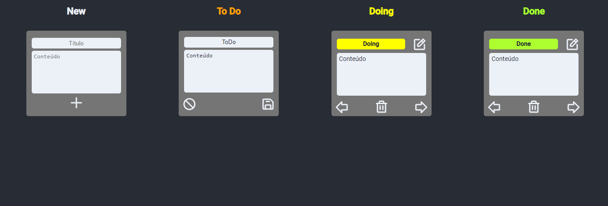

# Kanban clone

  Desafio frontend let's code 👩‍💻

  Verifique funcionando: <a href="https://kanban-herbaol15-k4me.vercel.app/"> Kanban clone </a>

 

  

## link do desafio frontend

https://gitlab.com/gabriel.militello1/desafio-tecnico-frontend

## Libs utilizadas

Criando projeto

    npm create vite@latest kanban-board --template react-ts
    npm install

Instalando styled-components

    npm install styled-components
    npm i -D @types/styled-components

Instalando lib de icones

    npm install --save phosphor-react

Lib para consumir APIs

    npm install axios

Lib para avisos

    npm install react-toastify

## 🚀 Tecnologias

- [ReactJS](https://reactjs.org/)
- [styled-components](https://styled-components.com/)
- [TypeScript](https://www.typescriptlang.org/)
- [Vitejs](https://vitejs.dev/)
- [Axios](https://axios-http.com/ptbr/docs/intro)

## 💻 Iniciando

Primeiro, clone o projeto:

    git clone git@github.com:K4ME/Kanban.git

Instale as dependências

    npm install

Rode

    npm run dev

## TODO

[x] Instalar pacote de icones 
[x] Instalar styled-components 
[x] Decidir cores do disign (preto, cinza, branco e amarelo) 
[x] Criar componente NewCard 
[x] Criar componente Card 
[x] Criar componente EditCard 
[x] Criar componente Board 
[x] Fazer chamada as apis (axios) 
[x] Botão de plus funcionando 
[x] excluir card quando clicar no Botão excluir 
[x] mudar 'lista' quando clicar no Botão de seta 
[x] chamar cards com map separado pelo valor do campo lista 
[x] criar header do componente Board 
[x] chamar editcard quando clicar no Botão edit 
[x] atualizar dados do card quando clicar no Botão de salvar 
[x] voltar dados do card quando clicar no Botão de cancelar 
[x] Instalar toastify 
[x] Tratar erros com toastify 
[x] Tratar sucessos com toastify 
[x] publicar front no vercel 

[] publicar o back 
[] Adicionar responsividade ao projeto 
[] Drag and drop 
[] Testes 

  Made with 💜 by <a href="https://www.linkedin.com/in/guilhermemacrini/">Guilherme Macrini</a>

